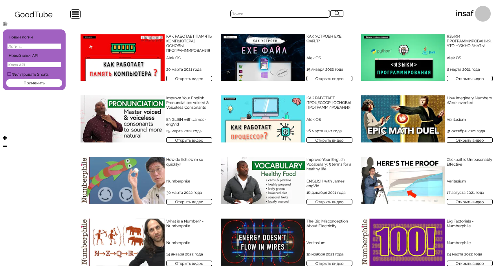

# GoodTube
## History 
I made this project in 2022 for the Big Challenges competition. Originally, GoodTube was supposed to help people avoid trash content and shorts from YouTube. Now it is 2024, and I abandoned this project because I did not pass to the final stage and there were no time and no passion to continue. If you want to explore more about it (surprisingly), just DM me in telegram and I will write more about the technical aspects and some tricky staff that could happen. 
## Brief overview
Since project is abandoned, I do not see the reason to write a comprehensive readme about the project, so there will be just brief overview of architecture and structure of the project.
### Architecture
Project consists of two parts: server side and client side.
#### Server side
Server side is responsible for storing data about already parsed channels. Parser uses user API keys for YouTube. I know, it sounds strange: to use user API keys to server side parsing, but there were several reasons that time. 
#### Client side
Client side is a PyQt5 app. App contains authorization (with plain password XD), settings change, and video player for parsed videos from choosen channels.

### Structure
```bash
├── config.ini
├── good_tube_interface.ui
├── icons
├── icons.qrc
├── python
│   ├── client_files
│   ├── server_files
├── README.md
├── styles
│   └── style.css
├── temp
└── опрос
    ├── table_analyzing.py
    └── table.csv
```
`config.ini` — file with configurations of the project <br>
`good_tube_interface.ui` — QT designer file <br>
`icons` — folder with icons used in app <br>
`icons.qrc` — QT designer file <br>
`python/client_files` — PyQT5 app source code<br>
`python/server_files` — Flask server code<br>
`styles` — styles for PyQT5 app<br>
`temp` — folder for storing app temp data<br>
`опрос` — folder with results of online survery about the app<br>
## Launch
Honestly, it will be treaky task even for me. But in general, you need to launch `api.py` in some vds, then somehow pass ip to the app and launch `gui.py` on the client side. 

## Fun staff
[Presentation which I have made for the project](https://docs.google.com/presentation/d/1kk3MRtvOJ4C5P9unEQXLI1VvEYC7LuhlHdljLRo7Qls/edit?usp=sharing)
